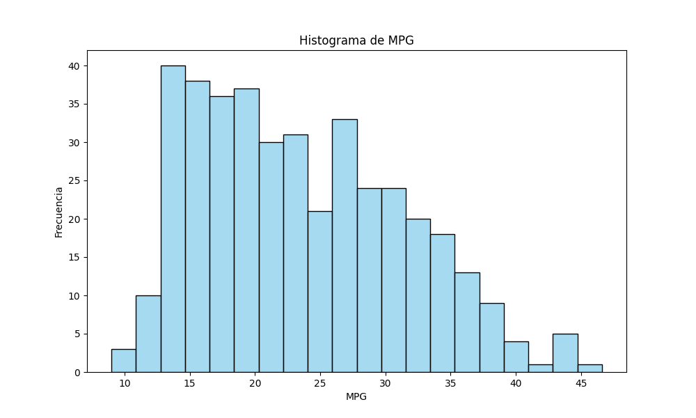
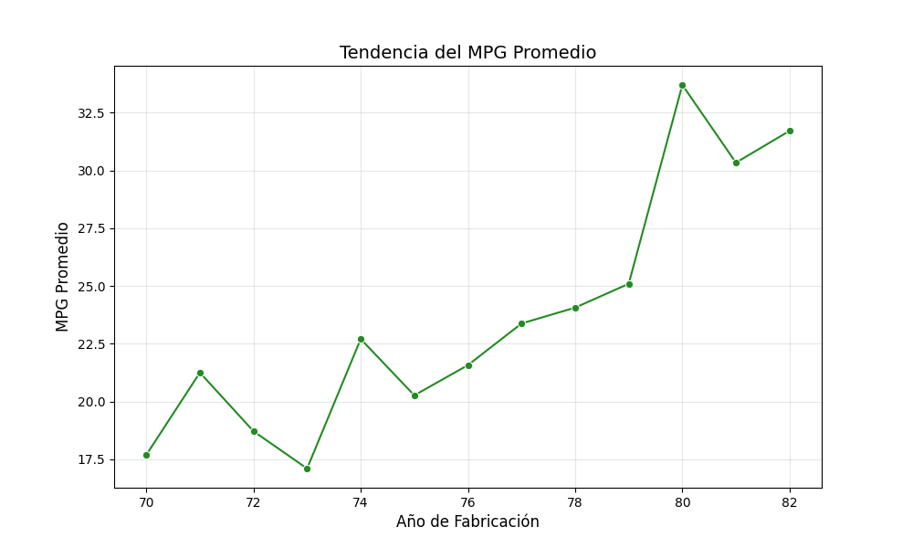
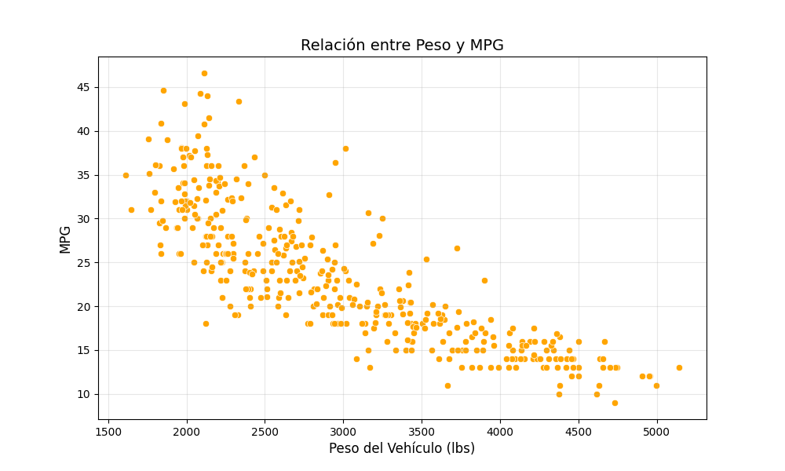

# 🌟 Análisis Exploratorio de Datos (EDA) en el Dataset de MPG 🚗📊  

)


---

## 📋 Descripción del Proyecto  

El **Dataset de MPG** (Millas por Galón) ofrece un conjunto de datos rico para analizar la eficiencia del combustible de vehículos según atributos como peso, potencia, origen y más. A través de este análisis exploratorio, buscamos descubrir patrones, visualizar tendencias y establecer relaciones estadísticas dentro de los datos.  

✨ **Objetivos principales:**  
- Investigar tendencias en la eficiencia del combustible.  
- Visualizar distribuciones de datos y detectar anomalías.  
- Realizar pruebas estadísticas inferenciales para validar hipótesis.  

---

## 🚀 Aspectos Destacados del Análisis  

### 📈 Principales Hallazgos:  
- **Tendencias en Eficiencia del Combustible**: Los vehículos de los años 80 muestran una mejora gradual en MPG.  
- **Impacto de los Cilindros**: Los vehículos con menos cilindros son significativamente más eficientes en combustible.  
- **Análisis por Origen**: Los autos de Asia generalmente superan a los de otras regiones en MPG.  

### 🧪 Pruebas Estadísticas Realizadas:  
1. **Prueba T**: Diferencias en MPG entre vehículos con más de 6 cilindros y los demás.  
2. **Prueba de Kruskal-Wallis**: Variaciones de MPG según el origen del vehículo.  
3. **Prueba de Chi-Cuadrado**: Relación entre variables categóricas como origen y cantidad de cilindros.  

### 📊 Aspectos Visuales:  
- Distribución de valores de MPG en todos los vehículos y subconjuntos específicos.  
- Análisis de tendencias del promedio de MPG a lo largo del tiempo.  
- Comparaciones entre atributos numéricos como peso, potencia y desplazamiento.  

---

## 📂 Estructura del Proyecto  

```plaintext
├── data/                # Archivos del dataset  
├── notebooks/           # Jupyter Notebooks para el análisis exploratorio  
├── src/                 # Scripts de Python para el análisis  
├── scripts/             # Gráficos generados durante el EDA  
├── README.md            # Descripción del proyecto (este archivo)  
```
---

## 🛠️ Herramientas y Librerías Utilizadas  

| Herramienta      | Uso                                                                 |
|------------------|---------------------------------------------------------------------|
| **Python** 🐍     | Lenguaje principal para manipulación y análisis de datos.         |
| **Pandas** 🐼     | Limpieza, transformación y análisis de datos tabulares.           |
| **Matplotlib** 🎨 | Creación de gráficos estáticos para visualización.                |
| **Seaborn** 📊    | Visualización avanzada de datos con gráficos estadísticos.         |
| **Scipy** 🔬      | Pruebas estadísticas e inferencia avanzada.                       |
| **Jupyter** 📓    | Entorno interactivo para escribir y ejecutar análisis paso a paso.|

---

## 📷 Visualizaciones  

### 🎨 Distribución de Valores de MPG  
Este gráfico muestra la distribución de los valores de MPG en todos los vehículos, resaltando diferencias significativas en eficiencia de combustible según los cilindros.  




### 📈 Tendencias del MPG Promedio  
El análisis de tendencias revela un aumento gradual en la eficiencia del combustible durante los años 80, probablemente impulsado por avances tecnológicos y regulaciones ambientales.  

  

### 🛠️ Comparaciones entre Peso y MPG  
Una visualización de dispersión que muestra cómo el peso de los vehículos afecta negativamente su eficiencia en combustible.  

  

---

## 🧠 Ejemplos de Inferencia Estadística  

### 1️⃣ **Prueba Mann-Whitney U**  
- **Hipótesis**: Los vehículos con más de 6 cilindros tienen menor eficiencia (MPG).  
- **Análisis**: Comparación de dos grupos independientes (vehículos >6 cilindros vs. el resto).  
- **Resultado**: Diferencia significativa encontrada (**p-valor < 0.05**).  

### 2️⃣ **Prueba de Kruskal-Wallis**  
- **Hipótesis**: El origen de los vehículos afecta el MPG promedio.  
- **Análisis**: Prueba no paramétrica para comparar MPG entre categorías de origen (Asia, Europa, América).  
- **Resultado**: Se encontraron diferencias significativas entre los grupos (**p-valor < 0.01**).  

### 3️⃣ **Prueba de Chi-Cuadrado**  
- **Hipótesis**: Existe una relación entre el origen del vehículo y la cantidad de cilindros.  
- **Análisis**: Relación entre dos variables categóricas.  
- **Resultado**: Asociación estadísticamente significativa (**p-valor < 0.05**).  

---

## 🎯 Conclusión  

1️⃣ **Eficiencia de Combustible**  
El análisis confirma que los vehículos con menor cantidad de cilindros y menor peso son significativamente más eficientes.  

2️⃣ **Impacto del Origen**  
Los autos asiáticos lideran en eficiencia, mientras que los vehículos estadounidenses tienden a tener valores de MPG más bajos.  

3️⃣ **Relación entre Atributos**  
Se observan patrones claros entre el tamaño del motor, el origen del vehículo y su eficiencia.  

4️⃣ **Tendencias Temporales**  
Los avances tecnológicos y normativas de la década de los 80 promovieron un aumento en el MPG promedio de los vehículos.  

Estos hallazgos son útiles para fabricantes, reguladores y consumidores interesados en la optimización del rendimiento de los vehículos.  

---
